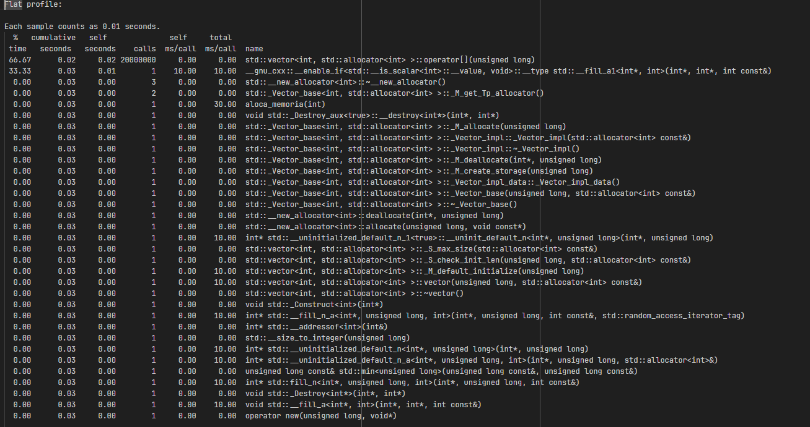

# Implementações de estruturas de Dados

## Como rodar o projeto

- **Necessário ter o compilador da linguagem c++ (g++)**
- **Gerando executavel**

O argumento -o gera um código otimizado

```shell
  $ g++ -o stack.exe stack.cpp
```

```bash
  $ ./stack.exe
```

## Estruturas lineares de Dados

- [x] Stack
- [ ] Queue
- [ ] List


## List

Estrutura mais genérica que pode ser implementado com diferentes métodos e aplicações.

### **Métodos que serão implementados**
- [ ] Insere em qualquer index da lista (.push(elemento, index))
- [ ] Imprime todos os valores (.printList)
- [ ] Retorna um vetor com todos os elementos (.toArrayList)
- [ ] Retorna um vetor com todos os elementos invertidos (.toReverse)
- [ ] Verifica se um elemento existe na lista e retorna booleano (.find)
- [ ] Retorna o index de um determinado valor (.findIndex)
- [ ] Retorna o elemento com maior valor .max()
- [ ] Retorna o elemento com menor valor .min()
- [ ] Remove em qualquer index da lista (.delete(elemento))
- [ ] Remove todos os elementos da lista .clear()
- [ ] Troca os elementos de duas listas


## Stack

A estrutura de dados Pilha (stack), funciona permitindo operações apenas em um lado da de uma lista ligada
por exemplo das regras de Pilha

Característica: Primeiro que entra é o último que saí (FILO)

- Insere no topo (.push)
- retorna o valor do topo (.top)
- Remove um valor da do topo (.pop)

Nesta implementação de pilha também haveram métodos não convencionais, como por exemplo:

- retorna numero de elementos


# Comparação entre Pilha e Fila

| Operação   | Pilha         | Fila                     |
| :--------: | :-----:       | :-----------:            |
| Inserir    | stack.push(x) | queue.push(index, value) |
| acessar    | stack.top()   | queue.print()            |
| remover    | pop()         | queue.remove(index)      |

## Relatório com gprov
Este relatório permite verificar o desempenho geral de cada linha de código do programa, 
desta forma facilita análises para saber qual parte precisa de refatoração.

No contexto deste projeto será usado para medir o desempenho das implementações de Algoritmos e Estruturas de Dados (DSA).

- -pg habilita o perfil para GPROF;
- -S gera um código assembly;


#### **1. Gerando arquivo gmon.out**
```shell
  $ g++ -pg -S stack.cpp -o stack.exe
```

#### **1. Gerando relatório .txt**
```shell
  $ gprof stack gmon.out > relatorio.txt
```

#### **Exemplo de Referância de um relatório gprof**

